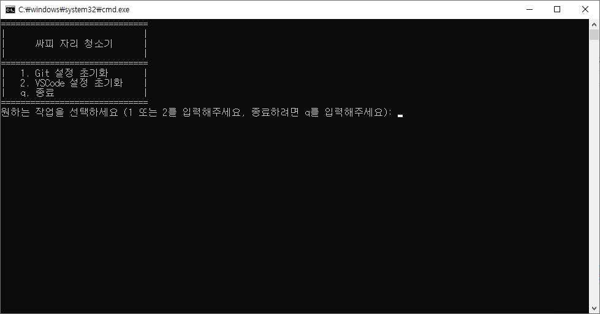

# ssafy-utils

### before-changing-seats.bat
- ssafy에서 자리를 이동하게 될 때 간편하게 PC 초기화를 진행할 수 있는 배치 프로그램
  - Git에 설정된 name, email 초기화
  - Git 토큰 초기화
  - Vscode 개인 설정 초기화
  - (예정) 웹 브라우저 설정 초기화

### git-start-setting.bat
- ssafy에서 새로운 자리에 Git 설정을 하는 배치 프로그램
  - autocrlf 설정
  - username, useremail 설정
  - credential.helper 설정

