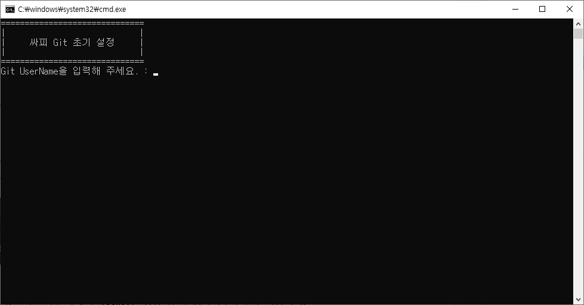

# ssafy-utils

### before-changing-seats.bat
ssafy에서 자리를 이동하게 될 때 간편하게 PC 초기화를 진행할 수 있는 배치 프로그램
- 고려중인 기능
  - 웹 브라우저 설정 초기화

- 1.0.0 (24.04.02)
  - Git에 설정된 name, email 초기화
  - Git 토큰 초기화
  - Vscode 개인 설정 초기화

### git-start-setting.bat
ssafy에서 새로운 자리에 Git 설정을 하는 배치 프로그램
- 1.0.0 (24.04.16)
  - autocrlf 설정
  - username, useremail 설정
  - credential.helper 설정
- 1.1.0 (24.04.18)
  - 등록할 계정 선택 옵션(Github, GitLab)

